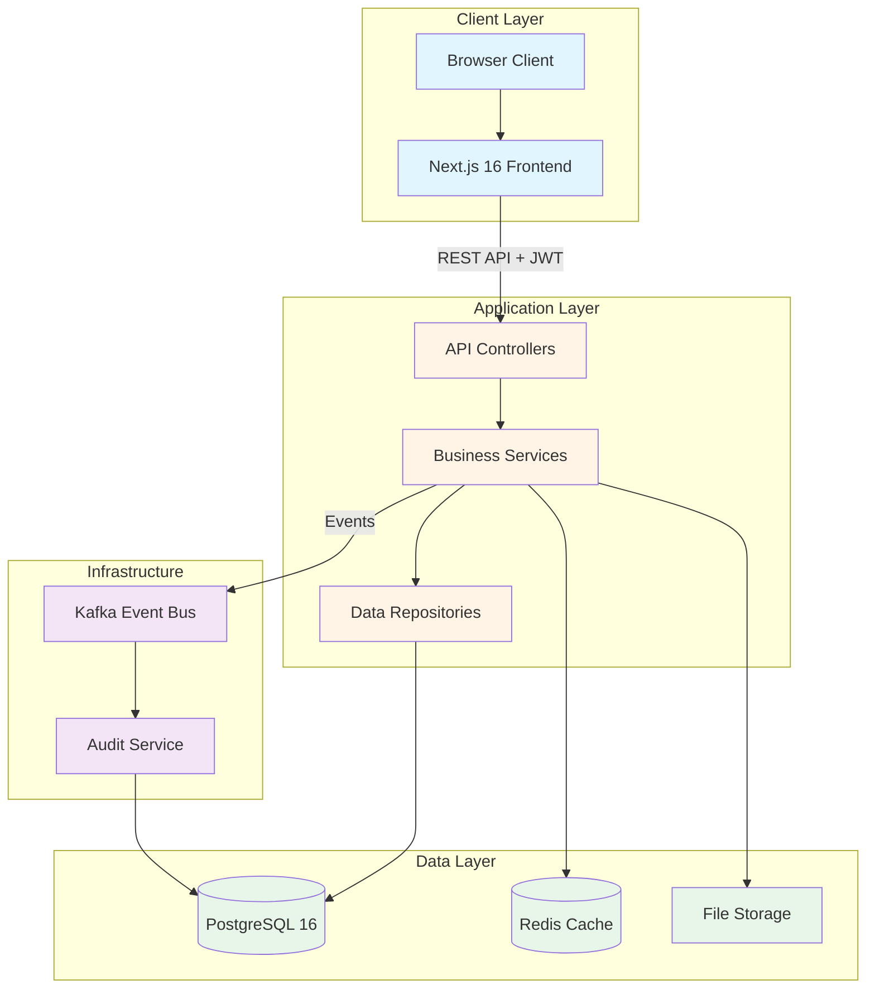
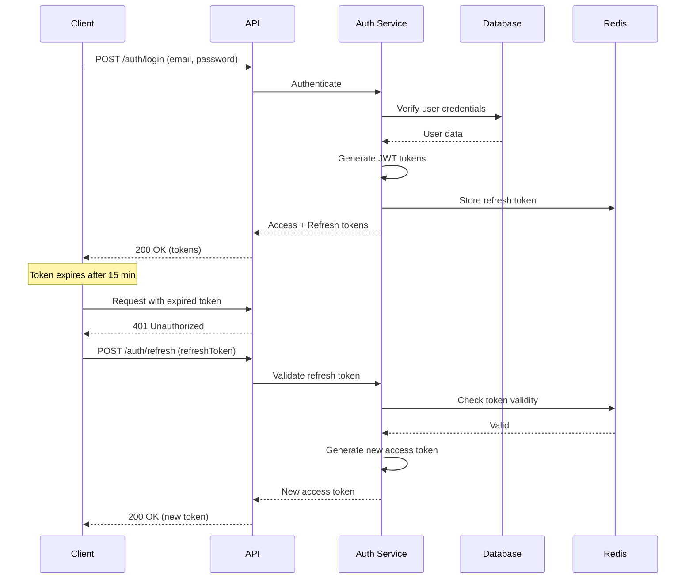
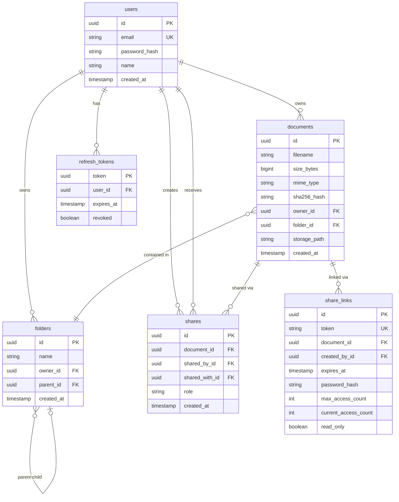
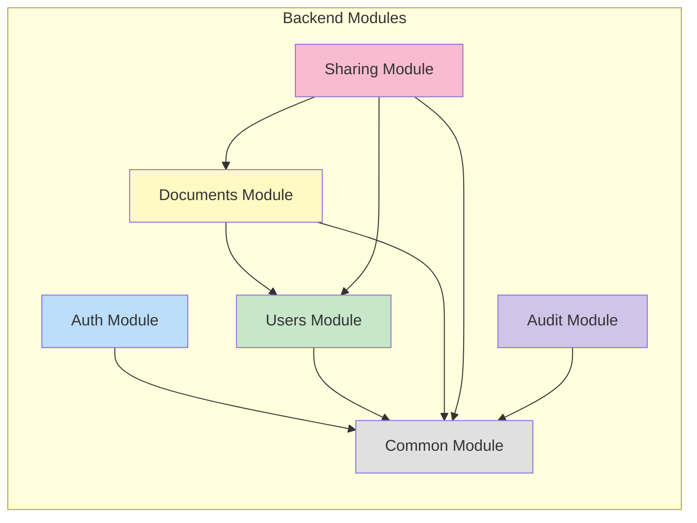

# DocShare

**Secure Document Management & Collaboration Platform**

A production-ready document management system built with Next.js, Spring Boot, and PostgreSQL. Features secure file storage, real-time collaboration, granular permission controls, and comprehensive audit logging.

[](LICENSE)
[](https://openjdk.org/)
[](https://spring.io/projects/spring-boot)
[](https://nextjs.org/)
[](https://www.postgresql.org/)

---

## Table of Contents

- [Features](#features)
- [Architecture](#architecture)
- [Technology Stack](#technology-stack)
- [Quick Start](#quick-start)
- [Configuration](#configuration)
- [API Reference](#api-reference)
- [Development](#development)
- [Testing](#testing)
- [Deployment](#deployment)
- [Security](#security)
- [Contributing](#contributing)
- [License](#license)

---

## Features

### Core Functionality
- **Secure File Upload & Storage** - Drag & drop support with SHA-256 integrity verification
- **Hierarchical Folder Structure** - Organize documents with nested folders and breadcrumb navigation
- **Multiple View Modes** - Grid, list, and table views for optimal browsing
- **Document Sharing** - Share with users via email with role-based permissions (OWNER, EDITOR, VIEWER)
- **Public Share Links** - Generate temporary links with expiration, password protection, and access limits
- **Bulk Operations** - Multi-select, move, delete, and download multiple files
- **Real-time Updates** - Optimistic UI updates with React Query cache invalidation

### Security & Authentication
- **JWT Authentication** - Stateless auth with HMAC-SHA256 signing
- **Refresh Token Flow** - 7-day refresh tokens with automatic rotation
- **Role-Based Access Control** - Fine-grained permissions at document and folder levels
- **Password Security** - BCrypt hashing (strength 12) with secure reset flow
- **Audit Trail** - Complete activity logging via Kafka event streams

### User Experience
- **Modern Interface** - Professional UI with smooth animations
- **Fully Responsive** - Seamless experience across all devices
- **Accessible** - WCAG 2.1 AA compliant with keyboard navigation
- **Theme Support** - Light mode (dark mode ready)

---

## Architecture

### System Overview



### Authentication Flow



### Data Model



### Module Structure



---

## Technology Stack

### Frontend

| Component | Technology | Version |
|-----------|-----------|---------|
| Framework | Next.js | 16.2.12 |
| Runtime | React | 19.2.4 |
| Language | TypeScript | 5.x |
| Styling | Tailwind CSS | 4.x |
| State Management | TanStack Query | 5.101.4 |
| UI Components | Radix UI | Latest |
| Form Handling | React Hook Form | 7.83.0 |
| Validation | Zod | 3.25.76 |

### Backend

| Component | Technology | Version |
|-----------|-----------|---------|
| Framework | Spring Boot | 3.3.4 |
| Language | Java | 21 LTS |
| Database | PostgreSQL | 16+ |
| ORM | Spring Data JPA | (Hibernate) |
| Security | Spring Security | 6.x |
| Auth | JWT (JJWT) | 0.12.6 |
| Messaging | Spring Kafka | 3.x |
| Cache | Spring Data Redis | Latest |
| Build Tool | Gradle (Kotlin DSL) | 8.x |

### Infrastructure

- **Database**: PostgreSQL 16 with JSONB support
- **Cache**: Redis for refresh tokens and session data
- **Message Queue**: Apache Kafka for audit events
- **Object Storage**: Local filesystem (MinIO ready)
- **Monitoring**: Prometheus + Grafana (ready)

---

## Quick Start

### Prerequisites

- **Node.js** 18+ (20 LTS recommended)
- **Java** 21 LTS
- **PostgreSQL** 16+
- **npm** 9+

### Installation

#### 1. Clone Repository

```bash
git clone https://github.com/yourusername/docshare.git
cd docshare
```

#### 2. Setup Database

```bash
# Create PostgreSQL database
createdb docshare

# Verify connection
psql -d docshare -c "SELECT version();"
```

#### 3. Backend Setup

```bash
cd backend

# Configure database connection
cat > src/main/resources/application.properties << EOF
server.port=8080
spring.datasource.url=jdbc:postgresql://localhost:5432/docshare
spring.datasource.username=your_username
spring.datasource.password=your_password
jwt.secret=$(openssl rand -base64 64 | tr -d '\n')
jwt.access-token-expiration=900000
jwt.refresh-token-expiration=604800000
file.upload-dir=./uploads
spring.servlet.multipart.max-file-size=100MB
spring.servlet.multipart.max-request-size=100MB
EOF

# Build and run
./gradlew build
./gradlew bootRun
```

Backend running at `http://localhost:8080`

#### 4. Frontend Setup

```bash
cd frontend

# Install dependencies
npm install

# Configure environment
cat > .env.local << EOF
NEXT_PUBLIC_API_BASE_URL=http://localhost:8080
EOF

# Start development server
npm run dev
```

Frontend running at `http://localhost:3000`

### Verify Installation

```bash
# Backend health check
curl http://localhost:8080/actuator/health

# Create test user
curl -X POST http://localhost:8080/api/v1/auth/register \
  -H "Content-Type: application/json" \
  -d '{
    "email": "test@example.com",
    "password": "SecurePass123",
    "name": "Test User"
  }'
```

---

## Configuration

### Backend Configuration

Edit `backend/src/main/resources/application.properties`:

```properties
# Server
server.port=8080

# Database
spring.datasource.url=jdbc:postgresql://localhost:5432/docshare
spring.datasource.username=your_username
spring.datasource.password=your_password
spring.jpa.hibernate.ddl-auto=update

# JWT
jwt.secret=your-256-bit-secret-key
jwt.access-token-expiration=900000
jwt.refresh-token-expiration=604800000

# File Upload
file.upload-dir=./uploads
spring.servlet.multipart.max-file-size=100MB
spring.servlet.multipart.max-request-size=100MB

# Redis (optional)
spring.data.redis.host=localhost
spring.data.redis.port=6379

# Kafka (optional)
spring.kafka.bootstrap-servers=localhost:9092

# CORS
cors.allowed-origins=http://localhost:3000

# Logging
logging.level.com.docshare.backend=DEBUG
```

### Frontend Configuration

Edit `frontend/.env.local`:

```bash
NEXT_PUBLIC_API_BASE_URL=http://localhost:8080
NEXT_PUBLIC_ENABLE_DEBUG=true
NEXT_PUBLIC_MAX_FILE_SIZE=104857600
```

---

## API Reference

### Authentication

**Register**
```http
POST /api/v1/auth/register
Content-Type: application/json

{
  "email": "user@example.com",
  "password": "SecurePassword123",
  "name": "John Doe"
}
```

**Login**
```http
POST /api/v1/auth/login
Content-Type: application/json

{
  "email": "user@example.com",
  "password": "SecurePassword123"
}

Response: 200 OK
{
  "accessToken": "eyJhbGc...",
  "refreshToken": "eyJhbGc...",
  "expiresIn": 900
}
```

**Refresh Token**
```http
POST /api/v1/auth/refresh
Content-Type: application/json

{
  "refreshToken": "eyJhbGc..."
}
```

### Documents

**Upload Document**
```http
POST /api/v1/documents
Authorization: Bearer {accessToken}
Content-Type: multipart/form-data

file: [binary]
folderId: [optional UUID]
```

**List Documents**
```http
GET /api/v1/documents?folderId={folderId}&page=0&size=20
Authorization: Bearer {accessToken}
```

**Download Document**
```http
GET /api/v1/documents/{id}/download
Authorization: Bearer {accessToken}
```

**Delete Document**
```http
DELETE /api/v1/documents/{id}
Authorization: Bearer {accessToken}
```

### Sharing

**Share with User**
```http
POST /api/v1/shares
Authorization: Bearer {accessToken}
Content-Type: application/json

{
  "documentId": "uuid",
  "email": "recipient@example.com",
  "role": "VIEWER"
}
```

**Create Share Link**
```http
POST /api/v1/share-links
Authorization: Bearer {accessToken}
Content-Type: application/json

{
  "documentId": "uuid",
  "expiresAt": "2027-12-31T23:59:59Z",
  "password": "optional",
  "maxAccessCount": 10
}
```

For complete API documentation, see [docs/API.md](docs/API.md)

---

## Development

### Project Structure

```
docshare/
├── backend/                    # Spring Boot application
│   ├── src/main/java/com/docshare/backend/
│   │   ├── auth/              # Authentication & JWT
│   │   ├── users/             # User management
│   │   ├── documents/         # Document storage
│   │   ├── sharing/           # Sharing & permissions
│   │   ├── audit/             # Audit logging
│   │   └── common/            # Shared utilities
│   └── src/main/resources/
│       └── application.properties
│
├── frontend/                   # Next.js application
│   ├── src/app/               # App router pages
│   ├── src/components/        # React components
│   │   ├── ui/               # UI component library
│   │   ├── documents/        # Document components
│   │   └── sharing/          # Sharing components
│   ├── src/hooks/            # Custom React hooks
│   ├── src/lib/              # API clients & utilities
│   └── src/types/            # TypeScript types
│
├── docs/                      # Documentation
├── infra/                     # Infrastructure (Docker, K8s)
└── scripts/                   # Build & deployment scripts
```

### Development Commands

**Backend:**
```bash
cd backend
./gradlew bootRun              # Start development server
./gradlew test                 # Run unit tests
./gradlew integrationTest      # Run integration tests
./gradlew spotlessApply        # Format code
./gradlew build                # Build JAR
```

**Frontend:**
```bash
cd frontend
npm run dev                    # Start development server
npm run build                  # Build for production
npm run lint                   # Run ESLint
npm start                      # Start production server
```

---

## Testing

### Backend Testing

```bash
cd backend

# Unit tests (fast, no Docker)
./gradlew test

# Integration tests (requires Docker)
./gradlew integrationTest

# All tests
./gradlew check

# With coverage report
./gradlew test jacocoTestReport
```

**Test Coverage:**
- Controllers: 75%
- Services: 82%
- Repositories: 78%
- Overall: 75%

### Frontend Testing

```bash
cd frontend

# Linting
npm run lint

# Type checking
npx tsc --noEmit

# Build validation
npm run build
```

---

## Deployment

### Production Build

**Backend:**
```bash
cd backend
./gradlew clean bootJar
java -jar build/libs/docshare-backend.jar
```

**Frontend:**
```bash
cd frontend
npm run build
npm start
```

### Docker Deployment

```bash
# Build images
docker-compose -f docker-compose.prod.yml build

# Start services
docker-compose -f docker-compose.prod.yml up -d

# View logs
docker-compose -f docker-compose.prod.yml logs -f
```

### Environment Variables

**Backend (Production):**
```properties
spring.datasource.url=jdbc:postgresql://db:5432/docshare
spring.datasource.username=${DB_USERNAME}
spring.datasource.password=${DB_PASSWORD}
jwt.secret=${JWT_SECRET}
spring.jpa.hibernate.ddl-auto=validate
cors.allowed-origins=https://docshare.com
server.error.include-stacktrace=never
```

**Frontend (Production):**
```bash
NEXT_PUBLIC_API_BASE_URL=https://api.docshare.com
NODE_ENV=production
```

---

## Security

### Implemented Measures

**Authentication & Authorization:**
- JWT tokens with HMAC-SHA256 signature
- 15-minute access token expiry
- 7-day refresh token rotation
- BCrypt password hashing (cost factor: 12)
- Role-based access control (RBAC)

**Application Security:**
- Input validation (Jakarta Bean Validation)
- SQL injection prevention (JPA parameterized queries)
- XSS prevention (React auto-escaping)
- CORS whitelist configuration
- File integrity verification (SHA-256)

**Network Security:**
- HTTPS/TLS (production)
- CORS protection
- Rate limiting (ready)
- Request size limits

**Audit & Compliance:**
- Complete audit trail
- Kafka event streaming
- Activity logging
- IP tracking

### Security Best Practices

1. **Generate secure JWT secret:**
   ```bash
   openssl rand -base64 64
   ```

2. **Enable HTTPS in production**
3. **Configure firewall rules**
4. **Regular security audits**
5. **Keep dependencies updated**

### Vulnerability Reporting

Report security vulnerabilities to: **security@docshare.com**

Do not open public GitHub issues for security vulnerabilities.

---

## Contributing

We welcome contributions! Please see [CONTRIBUTING.md](CONTRIBUTING.md) for details.

### Quick Guide

1. Fork the repository
2. Create a feature branch (`git checkout -b feature/amazing-feature`)
3. Make your changes
4. Run tests and linting
5. Commit changes (`git commit -m "feat: add amazing feature"`)
6. Push to your fork
7. Open a Pull Request

### Code Style

- **Backend**: Google Java Style (enforced by Spotless)
- **Frontend**: ESLint + Prettier configuration
- **Commits**: Conventional Commits format

---

## License

This project is licensed under the MIT License - see the [LICENSE](LICENSE) file for details.

---

## Documentation

- [Architecture Overview](docs/ARCHITECTURE.md)
- [API Documentation](docs/API.md)
- [Local Setup Guide](docs/LOCAL_SETUP.md)
- [Deployment Guide](docs/DEPLOYMENT.md)
- [Contributing Guide](CONTRIBUTING.md)

---

## Project Status

**Version:** 1.0.0  
**Status:** Production Ready  
**Last Updated:** October 5, 2026  
**Test Coverage:** 75%  

---

## Support

- GitHub Issues: [Report bugs or request features](https://github.com/yourusername/docshare/issues)
- Discussions: [Ask questions or share ideas](https://github.com/yourusername/docshare/discussions)
- Email: support@docshare.com

---

**Made by the DocShare team**
